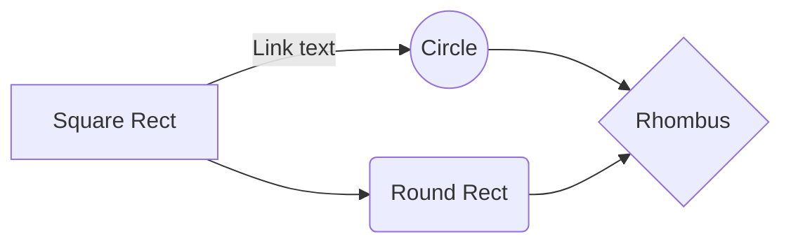

`` Università degli Studi di Milano ``
`` Corso di Editoria Digitale`` 
`` Anno Accademico``
`` Giulio Salada 951327`` 
`` Alessandro Canclini `` 

# Videocorso - Come produrre Musica in **nome DAW**. Corso medio-base.

## Introduzione

Obiettivo: Vendita di un Videocorso con in allegato documenti di approfondimento dei contenuti delle lezioni.
Verranno realizzati del files PDF/LaTex/MD nei quali saranno presenti sia approfondimenti testuali sugli argomenti, sia visivi (link a video "non in elenco" su Youtube o visibili da link).

## Obiettivi 

Destinatari: chi vuole approcciarsi sia al sound design, sia master engeneering o a musicisti interessati all'home recording.

Originalità: Corso inteso per chi produce musica e non solo incentrato sull'uso del DAW. 
Consigli utili a non snaturare le tracce audio e prepararle alla pubblicazione.

## Processo di produzione

- Studio competitor: molti canali Youtube amatoriali, ma le informaioni che forniscono sono spesso frammentarie, dispersive e non strutturate come un vero corso.

- Definizione del target: chi vuole approcciarsi sia al sound design, sia master engeneering o a musicisti interessati all'home recording.

- Studio e analisi del tema: ricerche sui manuali reali dei DAW, ricerche sugli effetti audio e plugin più usati interni e esterni al DAW.

- Definizione dei canali: sito web specifico, pubblicizzazione tramite dei shorts sui social (TikTok, Instagram, Facebook), eventuali lezioni in diretta su Teams/Zoom.
- licenze di distribuzione: eventuale certificazione ufficiale.
- Originalità e obbiettivi comunicativi: Corso inteso per chi produce musica e non solo incentrato sull'uso del DAW. 
Consigli utili a non snaturare le tracce audio e prepararle alla pubblicazione.
- Modello di business: vendita del pacchetto del corso.

Definizione dei formati  
Definizione dell’identità visuale

Identificazione delle fonti
Diritti e aspetti legali
Cronoprogramma  Suddivisione dei task

Descrivere le attività sviluppate all'interno del progetto per realizzare il prodotto.
> Nel farlo è utile riferirsi alle possibili attività elencate nella lezione 5, slide 4-7. 

## Gestione documentale

Descrivere il *flusso di gestione documentale* definito per il progetto. Ad esempio, la raccolta delle fonti, la revisione dei contenuti, la trasformazione dei formati, la strutturazione dei contenuti, la definizione dello stile grafico.
> Il flusso può essere descritto utilizzando BPMN, lezione 5, slide 9. In alternativa, se si preferisce restare su un formato di puro testo è possibile usare il linguaggio Mermaid, supportato da alcuni editor Markdown. 

## Tecnologie adottate

<!-- 
Conversione dei files MD in HTML, PDF e Latex CON PANDOC e caricati su GITHUB.
fare una tabella di conversione con i comandi pandoc.
 -->

> Per presentare il contributo delle diverse tecnologie addottate è possibile elencarle in una tabella. Può anche essere utili confrontare una versione ASIS del flusso di gestione, senza la tecnologia adottata, e una TOBE che include la tecnologia adottata.
> Includere nella relazione o in appendice gli script e le configurazioni adottati, possibilmente con riferimento ad un repository documentale.  

|                |Riduzione dei tempi di gestione                          |Miglioramento della qualità dei documenti                         |
|----------------|-------------------------------|-----------------------------|
|Markdown |`'Isn't this fun?'`            |'Isn't this fun?'            |
|XSLT       |`"Isn't this fun?"`            |"Isn't this fun?"            |
|ePud         |`-- is en-dash, --- is em-dash`|-- is en-dash, --- is em-dash|

## Conclusioni

Discutere i risultati ottenuti, verificando se gli obiettivi siano pienamente o parzialmente raggiunti. Evidenziare gli aspetti nei quali si sono raggiunti i risultati più soddisfacenti e le limitazioni emerse (impossibilità di accesso ad alcune tecnologie o fasi del flusso di gestione documentale, limiti nella automazione di alcune passi di trasformazione dei formati o di integrazione delle sorgenti). 

## Bibliografia e sitografia

Elencare i riferimenti bibliografici e risorse online che hanno maggiormente contribuito alla realizzazione del progetto.

> Ci possono essere diversi modi di gestire le citazioni in markdown, uno di questi è attraverso le note

Esempio di nota [^fn1]. Altro testo. Altra citazione[^fn2].

[^fn1]: Citazione con nota.
[^fn2]: Altra citazione.