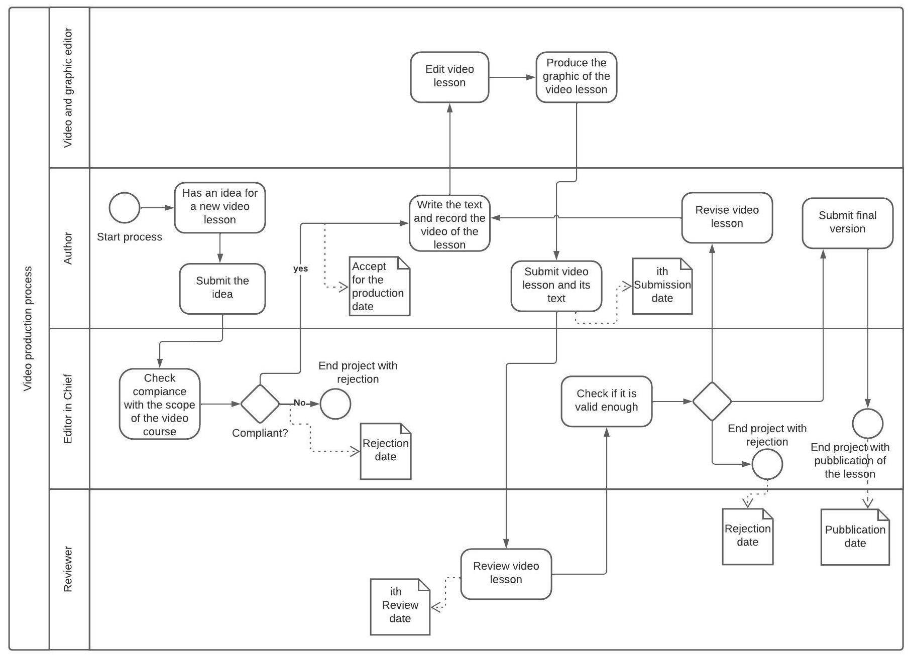

`` Università degli Studi di Milano ``
`` Corso di Editoria Digitale`` 
`` Anno Accademico 2022/2023``
`` Giulio Salada 951327`` 
`` Alessandro Canclini 943223`` 

# Videocorso - Come produrre Musica in [DAW]. Corso medio-base.

## Introduzione

Obiettivo: Vendita di un Videocorso con in allegato _documentazione_ per approfondire i contenuti delle _videolezioni_.
Verranno realizzati del files _HTML/EPUB/MD_ nei quali saranno presenti sia approfondimenti testuali sugli argomenti, sia visivi (link a video "non in elenco" su Youtube o visibili direttamente).

## Obiettivi 

- __Destinatari__: chi vuole approcciarsi sia al sound design, sia master engeneering o a musicisti interessati all'home recording.

- __Originalità__: Corso inteso per chi produce musica e non solo incentrato sull'uso del DAW. 
Consigli utili a non snaturare le tracce audio e prepararle alla pubblicazione.

## Processo di produzione
 
<!---->

- __Studio e analisi del tema__: produzione di un manuale per la produzione musicale alla fine della preparazione alla pubblicazione di tracce sui servizi di streaming.

 
<!---->

- __Studio competitor__: canali Youtube amatoriali, ma con informazioni che forniscono sono spesso frammentarie, dispersive e non strutturate come un vero corso.
- __Definizione del target__: chi vuole approcciarsi sia al sound design, sia master engeneering o a musicisti interessati all'home recording.
- __Studio e analisi del tema__: ricerche sui _manuali ufficiali_ dei [DAW], ricerche sugli _effetti audio_ e _plugin_ più utili interni e esterni al [DAW].
- Definizione dei canali: sito web specifico, pubblicizzazione tramite dei shorts sui social (TikTok, Instagram, Facebook), eventuali lezioni in diretta su Teams/Zoom.
- __licenze di distribuzione__: eventuale _certificazione_ ufficiale.
- __Originalità e obbiettivi comunicativi__: Corso inteso per chi produce musica e non solo incentrato sull'uso del [DAW]. 
Consigli utili a non snaturare le tracce audio e prepararle alla pubblicazione.
- __Modello di business__: vendita del pacchetto del corso.

 
<!---->

- __Definizione dei formati__: HTML/EPUB/MD
- __Definizione dell’identità visuale__: testo scritto con link a video.

 
<!---->

- Identificazione delle fonti: __manuali ufficiali__ del [DAW], riviste specializzate, etc.
<!--
- Diritti e aspetti legali: /////////
- Cronoprogramma: /////////
- Suddivisione dei task: /////////
-->

<!--
Descrivere le attività sviluppate all'interno del progetto per realizzare il prodotto.
> Nel farlo è utile riferirsi alle possibili attività elencate nella lezione 5, slide 4-7. 
-->

Il testo tratterà i seguenti punti: 

- Introduzione a Ableton: 
  - cos'è, 
  - a cosa serve, 
  - come funziona, 
  - quali sono le sue caratteristiche principali.
- Installazione e configurazione di Ableton: 
  - come attivare la licenza, 
  - come impostare le preferenze, 
  - come collegare le periferiche audio e MIDI.
- Interfaccia e navigazione di Ableton: 
  - come usare le due viste (Arrangement e Session), 
  - come gestire i browser, 
  - i dispositivi, 
  - le clip audio e midi, 
  - le tracce, 
  - i mixer, 
  - i dati MIDI in ingresso e uscita
  - le automazioni, 
  - i gruppi, 
- Produzione musicale con Ableton: 
  - come registrare, 
  - editare, 
  - arrangiare, 
  - mixare e masterizzare l'audio e il MIDI
  - come usare gli strumenti, 
  - gli effetti e i rack di Ableton, 
  - come creare e modificare i preset, 
  - come usare le funzioni di warping, slicing, quantizzazione, groove, resampling, freezing, flattening, bouncing.
  - settaggi per il rendering audio migliore per il rilascio del prodotto finale
- consigli e esempi di Creatività e performance con Ableton: 
  - come ottimizzare l'uso dei: clip, le scene, i crossfader, i follow actions, i locators, i marker, i loop, i ritornelli, le macro, i mapping, i controller, i dispositivi Max for Live, i dispositivi CV, i dispositivi MPE, i dispositivi di Live 11.

## Gestione documentale

​	

<!--Descrivere il *flusso di gestione documentale* definito per il progetto. Ad esempio, la raccolta delle fonti, la revisione dei contenuti, la trasformazione dei formati, la strutturazione dei contenuti, la definizione dello stile grafico.
> Il flusso può essere descritto utilizzando BPMN, lezione 5, slide 9. In alternativa, se si preferisce restare su un formato di puro testo è possibile usare il linguaggio Mermaid, supportato da alcuni editor Markdown. -->

## Tecnologie adottate

I files saranno accessibili tramite un sito HTML apposito mobile compliant in cui si potranno scegliere i formati più accessibili e consultare singolarmente le varie lezioni sia tramite pagina web sia tramite file locali.
I files sarannno scaricabili tramite dei bottoni sul sito che permetteranno di far partire il download delle lezioni disponibili su Github.
Per il download di files Markdown verrà fornito un file zippato (Github non consente il download di files multipli come archivio zip. Esistono repository esterne che eseguono questa procedura. Ci limiteremo a generare manualmente il file zippato).

Conversione con PANDOC dei files MD in:
- HTML:
    - pandoc --standalone --template Videocorso1.html Videocorso1.md
- EPUB:
    - ...
<!--- PDF:
    - pandoc -s -o Videocorso1.pdf Videocorso1.md
- DOCX:
    - pandoc -o Videocorso1.docx -f markdown -t docx Videocorso1.md
-->

Schema ASIS:
|          |Riduzione dei tempi di gestione  |Miglioramento della qualità dei documenti |
|----------|-------------------------------|-----------------------------|
|Markdown  | `Repository Github collaborativa` | `link modificabili e sezione Segnalazione/Commenti` |
|HTML/EPUB |`conversione con pandoc + eventuali librerie` | `miglioramento dell'HTML per automazione pagina WEB` |
|Video     |`montaggio con SW di editing video (eg. ShotCut) e pubblicazione in repository/Youtube` |  |
|social    |`pubblicazione di estratti sui social` |  |

Schema TOBE:
|          |Riduzione dei tempi di gestione  |Miglioramento della qualità dei documenti |
|----------|-------------------------------|-----------------------------|
| sezione commenti | `Pagina forum automatizzata con collegamento a un database` | `aggiunta di domande specifiche sulla qualità dei materiali` |
|altri formati |`conversione con pandoc + eventuali librerie` | `feedback dagli utenti su possibili miglioramenti o necessità di altri formati` |
| Download Markdown | `codice per il download automatico della cartella specifica della lezione in MD` | ` ` |

Purtroppo PDF e DOC non sembra permettano l'integrazione di video al loro interno se non tramite link.

<!-- 
> Per presentare il contributo delle diverse tecnologie addottate è possibile elencarle in una tabella. Può anche essere utili confrontare una versione ASIS del flusso di gestione, senza la tecnologia adottata, e una TOBE che include la tecnologia adottata.
> Includere nella relazione o in appendice gli script e le configurazioni adottati, possibilmente con riferimento ad un repository documentale.  

|                |Riduzione dei tempi di gestione                          |Miglioramento della qualità dei documenti                         |
|----------------|-------------------------------|-----------------------------|
|Markdown |`'Isn't this fun?'`            |'Isn't this fun?'            |
|XSLT       |`"Isn't this fun?"`            |"Isn't this fun?"            |
|ePud         |`-- is en-dash, --- is em-dash`|-- is en-dash, --- is em-dash|
 -->

## Conclusioni

L'accessibilità delle lezioni risulta essere molto alta ed intuitiva, sebbene debba essere confermata la piattaforma di hosting (Github) in relazione alla mole di materiale caricabile e allo spazio disponibile; nello specifico in futuro potrebbe essere valutato l'hosting dei files video per esempio su Youtube o su un server privato.
La realizzazione della prima lezione risulta essere soddisfacente con gli obiettivi prefissati soprattutto per i tempi di gestione.
Pandoc risulta essere uno strumento necessario e veloce soprattutto per la conversione in formati diversi al fine di garantire una più ampia accessibilità del materiale.
Un problema si riscontra però con il rilascio delle lezioni in formato Markdown: purtroppo Github non permette di scaricare una cartella intera zippata, ma solo i files singoli, se non tramite repository esterne come "https://downgit.github.io".

<!--
_Discutere i risultati ottenuti, verificando se gli obiettivi siano pienamente o parzialmente raggiunti. Evidenziare gli aspetti nei quali si sono raggiunti i risultati più soddisfacenti e le limitazioni emerse (impossibilità di accesso ad alcune tecnologie o fasi del flusso di gestione documentale, limiti nella automazione di alcune passi di trasformazione dei formati o di integrazione delle sorgenti)._
-->

## Bibliografia e sitografia

DAW: https://www.ableton.com/
 

[DAW]: https://www.ableton.com/

<!-- > Ci possono essere diversi modi di gestire le citazioni in markdown, uno di questi è attraverso le note

Esempio di nota [^fn1]. Altro testo. Altra citazione[^fn2].

[^fn1]: Citazione con nota.
[^fn2]: Altra citazione.
--
